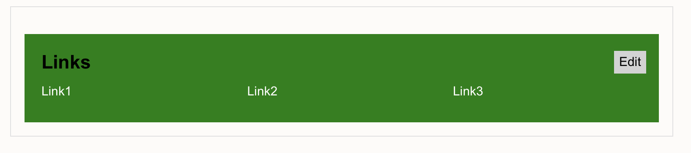

# Links block

Moodle block shows useful links on the Moodle dashboard. The links can be edited (remove/add new link). Updated links persist across browser sessions because these are stored using client-side storage. Default links are defined in the code and edited links can be reset to the default links set.

Version 1.0.1. [Code for the block](links.html)
