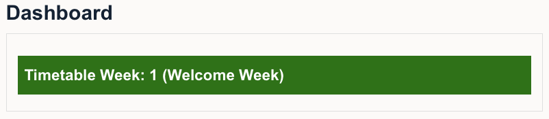

# Timetable block

Moodle block that shows automatically the current timetable and teaching weeks. Furthermore, it indicates the Welcome Week and the Reading Weeks. Start date of the acamademic year can easily be changed in the code as well as the definition of the autumn, spring, and reading weeks.

Version 1.0.3. [Code for the block](timetableweek.html)
