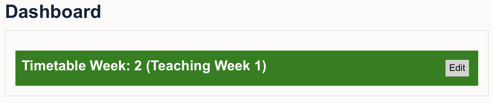

# Timetable block

Moodle block that shows automatically the current Academic timetable and teaching weeks. Furthermore, it indicates the Welcome Week, Assessment Weeks, Summer Weeks, Vacations, and Reading Weeks. Start date of the acamademic year and the week numbers for teaching, assessments, vacations, and reading weeks can be edited by clicking on the Edit button.

Version 1.1.0 [Code for the block](timetableweek.html)
